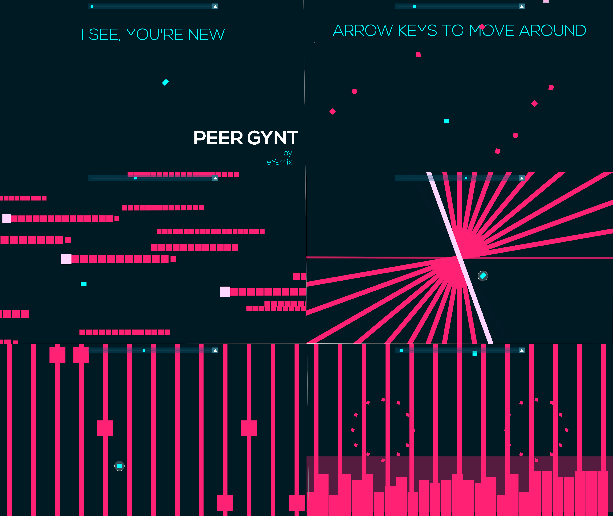
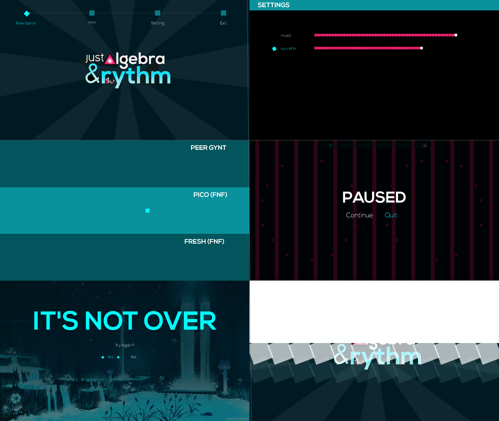

<h1 align="center"> 🔹 Just Algebra and Rythm 🔹</h1>

🌈 Once upon a time, a legend couldn't afford [Just Shapes and Beats](https://store.steampowered.com/app/531510/Just_Shapes__Beats) so he recreated it himself using Berzerk Studio, then call the game [Just Geometry and Music](https://youtu.be/MNGAaaZtKD4). Follow his footprint, I created **Just Algebra and Rythm** using `SDL2` - a framework written in `C++`.

🌈 **Just Algebra and Rythm** (Alg-Rythm) is a musical bullet-hell game, where the player must survive by avoiding bullets while enjoying the rythm whereas the dev is deeply engrossed in mathematics while making it. The game features multiple levels with various type of obstacles and really COOL music, which is so much fun (if you do not die).

Watch the game's [demo](https://youtu.be/hPkkl42hu78) here.

## Table of Contents

- [Prerequisites](#prerequisites)
- [Gameplay](#gameplay)
- [Controls](#controls)
- [Screenshots](#screenshots)
- [Credits](#credits)

## Prerequisites
This game is made for **academic purpose** only, so I assume that you have already had some programming experiences. Since my coding environment differs from others, my `makefile` won't work, which means you have to do it yourself. Sorry about that!

- `C++`
- `SDL2` already set up

## How to play
In Alg-Rythm, you are a tiny blue square (for real!), trying to survive from chaotic bullets.

### 💙 Health and Lives
- The player loses if they get hit more than 10 times
- After being hit, there's a short amount of time which the player is protected.
- While dashing, the player is invincible, but there's a small cooldown for that.

### 🎮 Controls
- Arrow keys are used for movement.
- Spacebar is used for dashing. 

The controls for Alg-Rythm is pretty simple and easy, but the game isn't!

## 📷 Screenshots

### Gameplay 

### Navigate

## 🎉 Credits
- Big shout out to [Just Shapes and Beats](https://store.steampowered.com/app/531510/Just_Shapes__Beats) developers for creating such a great game.
- Nice bullet pattern ideas from [Dương404](https://youtu.be/AMMPL25d_ks), a youtuber and a extraodinary gamer as well.
